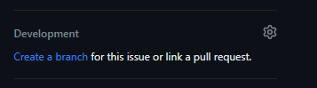

# Contributing

Thank you for wanting to make a contribution to our repo! 🤘

To ensure your contribution is able to be integrated into this repo, please follow the guidelines laid out in this document. 🙏

## 📝 Create an Issue

Adding a new contribution starts with a [GitHub issue](https://docs.github.com/en/issues/tracking-your-work-with-issues/about-issues) that effectively explains why a contribution is necessary.

> **Note**: Issues and associated Pull Requests should focus on a [single type of change](https://www.swarmia.com/blog/why-small-pull-requests-are-better/#:~:text=Small%20pull%20requests%20help%20protect%20your%20flow&text=To%20work%20in%20small%20pull,add%20feature%20gate%E2%80%9D%2C%20etc.) (i.e. "Add table metadata") rather than adding numerous functionality in one go (i.e. "Create pipeline, build docs, add CODEOWNERS").

1. Head over to this repo's issues and click `New issue`.
2. Choose the issue form that best characterizes what type of contribution you'd like to make.  If you're sure that none of the forms accurately capture the type of contribution you're making, click `Open a blank issue`.
3. If opening a blank issue, ensure the title and description clearly convey why this contribution is necessary.  This serves as documentation to your future self and others.
4. Add any other applicable labels to your issue.
5. Assign the issue to yourself, or to other(s) as necessary.

## 🌿 Create a Branch

Now it's time to create a place where the work is to be performed.  You can simply create a branch tied to the issue by clicking `Create a branch` on the right hand side of the page under "Development":



> 😟 **No `Create a branch` option**?  You likely don't have write permission to the repo.  Get in touch with the project maintainers about getting added to a relevant GitHub team with write permission or being granted write permission individually.

### Branch Naming Convention

GitHub will autogenerate a branch name based on the issue, of the form: `<issue number>-<issue title>`.  This is sufficient for most cases.  But if the branch name is lengthy, consider shortening it, ensuring the issue number is at the beginning of the name!  Because you already created a good issue, the issue number is sufficient to point other developers to the purpose of the branch. 👌

## 🔨 Develop!

Now for the fun part!

1. Clone the repo to where you'll be developing.
2. Check out the branch you just created:
   ```bash
   git fetch origin
   git checkout <branch name>
   ```
3. Write code.
4. Make [signed commits](https://docs.github.com/en/authentication/managing-commit-signature-verification/signing-commits) according to our [commit message convention](#commit-message-convention) to your branch on the remote repo.
5. Run checks locally to ensure everything looks good.  Some examples include testing, linting, or building docs.
6. Ensure that you've added sufficient tests, comments/docstrings, and documentation to support the changes you're introducing to the codebase.

### Commit Message Convention

Our commit message convention adopts the established [Angular commit convention](https://github.com/angular/angular/blob/22b96b9/CONTRIBUTING.md#-commit-message-guidelines), while providing some direction on [scopes](#scopes):

```
<type>(<scope>): <short summary>
  │       │             │
  │       │             └─⫸ Summary in present tense. Not capitalized. No period at the end.
  │       │
  │       └─⫸ Commit Scope (optional): Additional contextual information
  │
  └─⫸ Commit Type: build|ci|docs|feat|fix|perf|refactor|style|test
```

#### Types

Check out [Angular's types](https://github.com/angular/angular/blob/22b96b9/CONTRIBUTING.md#type).

#### Scopes

These are optional.  While Angular has a [fixed set of scopes](https://github.com/angular/angular/blob/main/CONTRIBUTING.md#scope), we don't set a fixed list of allowed scopes across the organization, though you may adopt a fixed set of scopes at your repo level.  Choose a scope that enhances the information communicated in the commit message.  Some scopes may include `authentication`, `settings`, `translation`, etc.

#### Examples

##### Good

```bash
build(deps): upgrade `django` from 3 -> 4
```

```bash
test: change `client` fixture scope from "function" to "session"
```

#### Bad

```bash
updated the build
```

```bash
test: make the tests pass
```

## 🔀 Create a Pull Request

It's time to use a [GitHub Pull Request](https://docs.github.com/en/pull-requests/collaborating-with-pull-requests/proposing-changes-to-your-work-with-pull-requests/about-pull-requests) (PR) to let the repo maintainers know that your proposed changes are ready to be reviewed.

1. Go to the repo's `Pull requests` tab.
2. Click `New pull request`.
3. Keep the "base" branch as the repo default branch (likely `main`), and set the "compare" branch as the branch you performed your work on.
4. Click `Create pull request`.
5. **Provide a good title and description**.  It's important that the PR title description clearly and adequately capture the changes being introduced.  Do not duplicate content from the issue that is tied to this PR, but rather describe the work you did.

   > **Note**: your future self will thank you for a good PR writeup when you're checking out what changes were introduced during a specific PR.

6. If the project uses [GitHub CODEOWNERS](https://docs.github.com/en/repositories/managing-your-repositorys-settings-and-features/customizing-your-repository/about-code-owners), you may notice that the reviews are set to relevant CODEOWNERS.  If not, you will have to manually select which reviewer(s) you want to review your PR.
7. If necessary, address and make changes according to feedback from the PR reviewer(s) or from any failed PR checks (like unit tests or linting).
8. Once your changes have been approved, a repo maintainer will merge your PR or ask you to merge it! 🚀
